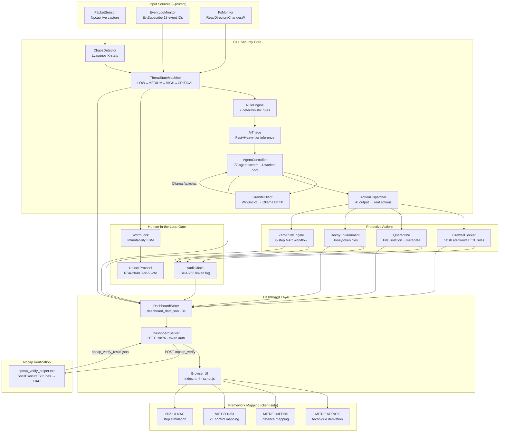

# Astartis — Autonomous AI Cybersecurity SOC Platform

**IBM AI Builders Challenge — Wildcard Track**  
*Build Intelligent Systems for the Future of Work*

---

## Problem Statement

Security operations teams are overwhelmed. A typical SOC analyst handles dozens of alerts per shift, each requiring log correlation, threat classification, response decision, and compliance documentation. At current staffing levels, most organisations take **hours to days** to triage a critical alert — and every minute of that gap is exposure time.

Existing Security Information and Event Management (SIEM) tools aggregate data but still require a human to decide and act. AI-assisted tools still route decisions through cloud APIs, introducing latency, cost, data-sovereignty risk, and a single point of failure. Neither approach works for air-gapped or high-sensitivity environments.

**Astartis** addresses this directly: It is an AI assisted Cyberdeck SUITE, fully offline SOC platform, which still keeps humans in the loop for destructive actions like, active immutabilty . It runs 77 specialised AI security agents on local IBM Granite models, makes real protective decisions (firewall blocks, file quarantine, deception deployment), and maintains a tamper-evident audit chain — all without a human in the loop for routine operations, and with a cryptographic multi-party approval gate for any irreversible action.

The intended user is a security team that needs faster triage, audit-ready compliance evidence, and autonomous first-response on a Windows endpoint or server — without sending data to a cloud API.

---

## Architecture

### System Overview



### How It Works

**The security core** is a single Windows binary (`astartis_bridge.exe`) written entirely in C++17. It has no web framework dependency and no runtime interpreter — it is a native Win32 process.

**Input sources** (active only with `--protect` flag + elevation):
- `PacketSensor` opens a Npcap raw capture handle on the best available adapter and computes Shannon entropy per packet. Entropy windows feed `ChaosDetector`.
- `EventLogMonitor` subscribes to Windows Security/System/Application event logs via `EvtSubscribe`. 18 specific event IDs (4625, 4688, 4697, 7045, etc.) are scored and fed to `ThreatStateMachine`.
- `FsMonitor` watches Downloads, Desktop, Temp, and AppData with `ReadDirectoryChangesW`.

**The threat pipeline**:
1. `ChaosDetector` computes Lyapunov K-statistic over entropy windows. K > 0.7 = anomalous.
2. `ThreatStateMachine` advances through LOW → MEDIUM → HIGH → CRITICAL based on accumulated signal score.
3. `RuleEngine` applies 7 deterministic rules that can override or suppress AI recommendations.
4. `AiTriage` submits classified alerts to IBM Granite models via `GraniteClient` (raw WinSock2 HTTP to a local Ollama instance — no cloud).
5. `ActionDispatcher` parses structured AI output (JSON + regex fallback) and routes to `FirewallBlocker`, `Quarantine`, `DecoyEnvironment`, or `ZeroTrustEngine`.

**IBM Granite model tiers** (all run locally via Ollama):

| Tier | Model | Use Case | Timeout |
|------|-------|----------|---------|
| FAST | `granite3.1-moe:3b` | Log parsing, rapid status | 30s |
| HEAVY | `granite3.1-dense:8b` | Reasoning, alert analysis | 60s |
| ACCURACY | `ibm/granite4.1:8b-q5_K_M` | Forensics, deep investigation | 360s |
| ORCHESTRATOR | `ibm/granite4.1:8b-q5_K_M` | Multi-agent coordination | 360s |

**The 77-agent swarm**: 65 JSON persona agents (SOC, pen test, compliance, threat intel) + 12 ECC Markdown agents (specialist roles including `cpp_security_reviewer`, `attack_surface_mapper`, `autonomous_response_operator`). Each agent has a named system prompt, skill set, model tier preference, and token budget. `AgentController` dispatches tasks to a 4-thread worker pool with priority queuing (HIGH/NORMAL/LOW).

**WORM immutability + multi-party unlock**: When `WormLock` engages (CRITICAL threat tier, confirmed destructive action), all destructive operations are blocked. Unlock requires a 3-of-5 RSA-2048 cryptographic vote from registered approvers across both ASTARTIS and CLIENT sides. This is the human-in-the-loop gate for irreversible actions — the system cannot unlock itself.

**Audit chain**: Every action — agent dispatch, firewall block, quarantine, decoy event, NAC decision, WORM state change — is recorded in an in-memory SHA-256 linked list. Each entry hashes the previous entry's hash, making the chain tamper-evident. The chain is visible in the Evidence tab.

**Framework mapping** (all client-side, zero C++ changes needed):
- MITRE ATT&CK: derives technique hits from `decoy_events[]` using the same pattern rules as `attribution_report.cpp`
- MITRE D3FEND: maps each active Astartis subsystem to its D3FEND defensive technique category
- NIST 800-53: maps Zero Trust decisions to NIST AC/AU/IA/SI controls
- 802.1X NAC: simulates an 8-step NAC workflow step-by-step in the browser

---

## IBM AI Builders Challenge — Submission Details

**Track:** Wildcard — *Build Intelligent Systems for the Future of Work*

**Relevance to theme:** Astartis represents AI co-workers that operate autonomously within defined policy bounds. The 77-agent swarm replaces the tier-1 and tier-2 SOC analyst functions — not by summarising information for a human to act on, but by taking the protective action directly (firewall rule, quarantine, deception deployment) while keeping a complete audit trail for human review. The WORM lock + multi-party unlock ensures the system cannot autonomously perform irreversible destructive actions without human sign-off, which is the key safety constraint for autonomous AI workers.

**IBM Bob usage:** IBM Bob was the primary development and audit tool throughout the entire build:
- 11 formal audit passes (documented in `audits/`) covering every source file
- Each pass: diagnose from real code → identify root cause → apply minimal fix → rebuild → verify output
- Specific session fixes: npcap_verify_helper timeout (wrong adapter selection — CWD-relative paths resolved incorrectly), entropy/chaos chart flat-line (pushing only tail value instead of all windows), agent swarm not loading in `--dashboard` mode (CWD mismatch fixed with `GetModuleFileNameA`), ClamAV service startup, `activateTab` not rendering tab data on first switch
- The iterative diagnose-fix-verify workflow in this final session is a direct demonstration of Bob as an AI engineering co-worker

---

## Prerequisites

The following must be installed on your Windows 10+ x64 machine before building:

### Required

| Prerequisite | Version | Install |
|---|---|---|
| **Visual Studio 2022** (or Build Tools) | Any edition | [visualstudio.microsoft.com](https://visualstudio.microsoft.com/) — select "Desktop development with C++" workload |
| **CMake** | ≥ 3.15 | Included with VS, or [cmake.org](https://cmake.org/download/) |
| **OpenSSL** | Win64 | [slproweb.com/products/Win32OpenSSL.html](https://slproweb.com/products/Win32OpenSSL.html) — install to `C:\Program Files\OpenSSL-Win64` |
| **Npcap** (runtime) | Latest | [npcap.com/#download](https://npcap.com/#download) — install with "WinPcap API-compatible mode" checked |
| **Npcap SDK** | Latest | Same page — download the SDK zip and extract to **`C:\npcap-sdk`** (this exact path is the CMake default) |
| **Ollama** | Latest | [ollama.com](https://ollama.com) — installs as a background service |

### Optional (for full protection mode)

| Prerequisite | Purpose |
|---|---|
| **ClamAV** | File scanning. Install from [clamav.net](https://www.clamav.net/). After install: run `Start-Service clamd` as admin. Set to Automatic: `Set-Service clamd -StartupType Automatic` |

### Granite Models (pull after Ollama is installed)

```powershell
ollama pull granite3.1-moe:3b
ollama pull granite3.1-dense:8b
ollama pull ibm/granite4.1:8b-q5_K_M
```

**Note:** `ibm/granite4.1:8b-q5_K_M` is ~5.5 GB. All three models stay on-device. No cloud API calls are made at any point.

---

## Build Instructions

### 1. Clone the repository

```powershell
git clone https://github.com/YOUR_USERNAME/astartis.git
cd astartis
```

### 2. Configure and build (CMake)

From a **Developer PowerShell for VS 2022** prompt (or any shell where `cl.exe` is in PATH):

```powershell
# Configure
cmake -B build -DCMAKE_BUILD_TYPE=Release -DNPCAP_SDK_DIR="C:/npcap-sdk"

# Build the main binary
cmake --build build --config Release --target astartis_bridge
```

Or use the included `build.bat` which handles VS environment setup automatically:

```batch
build.bat
```

**Output:** `build\Release\astartis_bridge.exe` (~950 KB)

### 3. Build the Npcap verify helper (separate step)

The `npcap_verify_helper.exe` must be compiled separately because it carries a UAC manifest (`requireAdministrator`) that forces a fresh Windows elevation prompt every run. This is the mechanism behind the "⚡ Verify Npcap" button in the dashboard.

From **any PowerShell** (it bootstraps its own MSVC environment):

```powershell
cd bridge\npcap_verify_helper
.\build.ps1
```

This compiles `npcap_verify_helper.cpp`, embeds the UAC manifest with `mt.exe`, and copies the result to `dashboard\npcap_verify_helper.exe`. You only need to run this once after cloning, or again if you modify the helper source.

### 4. Launch the dashboard

```powershell
.\build\Release\astartis_bridge.exe --dashboard
```

Open: **http://127.0.0.1:9876/**

The browser opens automatically. The dashboard polls for data every 3 seconds. All 77 agents appear in the Agents tab immediately.

### 5. Launch full protection mode (requires admin elevation)

In an **elevated** PowerShell:

```powershell
.\build\Release\astartis_bridge.exe --protect --dashboard
```

This additionally starts:
- `PacketSensor` (Npcap live capture → entropy → chaos detection)
- `EventLogMonitor` (Windows Security/System/Application log subscription)
- `FsMonitor` (filesystem change watcher)
- `AutonomyLoop` (30-second autonomous agent dispatch tick)

---

## Common Pitfalls

**Npcap SDK not found at cmake configure time**  
The CMake default is `C:/npcap-sdk`. If you extracted the SDK elsewhere, pass `-DNPCAP_SDK_DIR="C:/your/path"`. The directory must contain `Include/pcap.h` and `Lib/x64/wpcap.lib`.

**Visual Studio path not found in build.bat**  
VS 2022 installer uses the internal version number as the folder name on some machines (e.g. `Microsoft Visual Studio\18\` instead of `\2022\`). `build.bat` tries both. If it still fails, open a **Developer Command Prompt for VS 2022** manually and run `cmake` from there.

**Wrong architecture (x86 instead of x64)**  
Always use `vcvars64.bat` or the x64 Developer Command Prompt. The Npcap SDK only ships `Lib/x64` libraries. A 32-bit build will fail at link time with missing `.lib` files.

**`npcap_verify_helper.exe` picks wrong adapter**  
On machines with VPN software, virtual adapters (WAN Miniport, TAP-Windows, Hyper-V) may appear before real adapters. The helper's scoring logic prefers adapters matching Qualcomm/Intel/Realtek/802.11 keyword patterns. If capture returns 0 packets, check `Get-NetAdapter` to confirm your real adapter is `Status: Up`.

**ClamAV shows MISSING**  
The `clamd` service is installed with `StartupType = Manual` by default. Run `Start-Service clamd` as admin, or set it to automatic: `Set-Service clamd -StartupType Automatic`.

**Agents show 0/77 in dashboard**  
This happens if the bridge is launched from a working directory that doesn't resolve the relative paths to `agents/definitions/`. The fix (`GetModuleFileNameA`-based path resolution) is already in the current codebase — just make sure you're running the binary built from this source, not an older cached build.

**OpenSSL not found by CMake**  
Confirm OpenSSL is at `C:\Program Files\OpenSSL-Win64`. If installed elsewhere: `cmake -B build -DOPENSSL_ROOT_DIR="C:/your/openssl/path"`.

---

## Running the Tests

```powershell
cd build
ctest -C Release --output-on-failure
```

Tests that require external dependencies (Ollama, ClamAV, elevation) return exit code 2 and are marked SKIP — they do not fail the suite. Tests that require Ollama will be skipped if the service is not running.

---

## Dashboard Tabs

| Tab | What it shows | Data source |
|---|---|---|
| Overview | KPIs, threat level, chaos K chart, alerts | Live poll |
| Terminal | Whitelisted command execution (21 commands) | `/exec` endpoint |
| Network | Packet entropy windows chart + table | PacketSensor / seed |
| Agents | All 77 loaded agents, tier, status, task count | AgentController |
| Sandbox | Honeytoken file mirror | DecoyEnvironment |
| NAC | Zero Trust 8-step workflow simulation | ZeroTrustEngine |
| Evidence | SHA-256 audit chain, quarantine log | AuditChain |
| ATT&CK | MITRE technique hit map | Derived from decoy_events |
| D3FEND | MITRE defensive layer mapping | Live subsystem state |
| NIST | 800-53 control coverage + ZT donut | zerotrust_decisions |
| 802.1X | NAC step-by-step simulation | nac_workflow |
| Configure | Runtime config, firewall rules, models | `/config` endpoint |

---

## Known Limitations

- **Entropy/chaos data is seeded in `--dashboard` mode.** When running without `--protect`, the Packet Entropy Windows and Chaos K chart display 20 synthetic data points (realistic-looking, not real network traffic). Real data requires `--protect --dashboard` with elevation and an active Npcap capture.

- **Audit chain is in-memory only.** The SHA-256 linked list does not persist across process restarts. On shutdown, the audit log is lost. This is noted as acceptable for the demo scope.

- **Veeam/IBM Storage interface is stubbed.** `VeeamInterface` demonstrates the API surface but makes no real backup calls.

- **ClamAV integration requires the clamd service to be running.** The scanner uses the TCP/3310 STREAM: protocol. If clamd is not running, file scan operations are no-ops (logged, not fatal).

- **WORM unlock threshold is 3-of-5 (demo scale).** A production deployment would use the full 12-approver multi-party scheme described in the unlock protocol implementation.

- **`--protect` requires admin elevation.** Windows Security event log subscription (`EvtSubscribe` on the Security channel) requires elevated privileges. The dashboard-only mode does not require elevation.

- **Windows only.** The codebase uses Win32 APIs throughout (EvtSubscribe, ReadDirectoryChangesW, Npcap, netsh, PDH). A Linux port would require significant rework.

---

## Project Structure

```
astartis/
├── bridge/                     # Main binary sources
│   ├── astartis_bridge.cpp     # Entry point — all commands + subsystem init
│   ├── dashboard_writer.cpp/h  # JSON serialization, PDH metrics
│   ├── dashboard_server.cpp/h  # HTTP server, /exec, /config, /npcap_verify
│   ├── nlohmann/json.hpp       # Header-only JSON library (bundled)
│   └── npcap_verify_helper/    # UAC-elevated Npcap helper
│       ├── npcap_verify_helper.cpp
│       ├── npcap_verify_helper.manifest
│       └── build.ps1
├── core/                       # C++ security subsystems (each a static lib)
│   ├── audit_chain/
│   ├── chaos_detector/
│   ├── crypto_identity/
│   ├── decoy/
│   ├── firewall/
│   ├── packet_sensor/
│   ├── quarantine/
│   ├── rule_engine/
│   ├── threat_level/
│   ├── unlock_protocol/
│   ├── worm_lock/
│   └── ...                     # (14 subsystems total)
├── agents/
│   ├── controller/             # AgentController, GraniteClient, ActionDispatcher
│   ├── definitions/            # 65 JSON agent personas
│   ├── ecc/                    # 12 ECC Markdown agent personas + adapter
│   └── skills/                 # Shared skill definitions (JSON)
├── network_arch/
│   ├── zerotrust/              # NAC workflow + ZT engine
│   └── segmentation/           # SSID/VLAN config (header-only)
├── dashboard/
│   ├── index.html              # Single-page dashboard UI
│   ├── script.js               # All frontend logic (~1820 lines)
│   └── style.css               # Dashboard styles
├── tests/                      # CTest unit + integration tests
├── scripts/
│   ├── benchmark_tiers.cpp     # Manual Granite tier benchmark
│   └── install-protect-service.bat
├── configs/                    # Runtime config presets
├── audits/                     # 11 audit pass findings + system truth
├── CMakeLists.txt
└── build.bat
```

---

*Astartis v3.2 — IBM AI Builders Challenge (Wildcard) — Made with IBM Bob*
